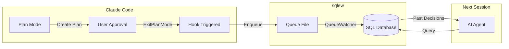
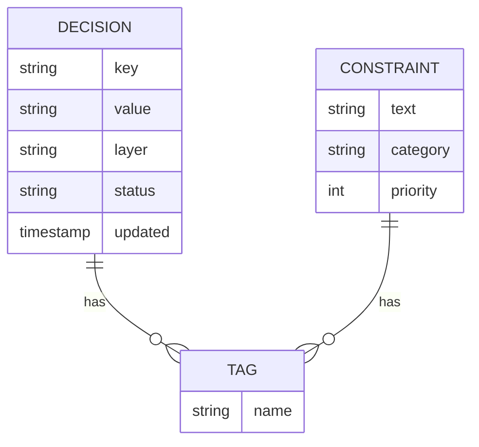

# Decisions & Constraints for AI Development

Persistent design context — decisions and constraints recorded as structured data — gives AI agents architectural memory across sessions. sqlew makes this zero-effort: plan normally, and hooks capture your decisions automatically.

## Why Persistent Design Context Matters

Research shows that recording design intent dramatically improves LLM code generation:

- **22.4% reduction** in overall development time
- **80% of tasks** completed faster with design intent available
- **50%+ improvement** in feature-addition and architectural-change tasks
- **137% increase** in design decision references by final tasks — AI learns to leverage past context more over time

> Kitayama, S. (2026). *Rediscovering Architectural Decision Records: How Persistent Design Context Improves LLM Code Generation*. [DOI](https://doi.org/10.36227/techrxiv.177205025.54351571/v1)
>
> Blog post: [Recording Design Intent for AI Efficiency](https://blog.sqlew.io/recording-design-intent-for-ai-efficiency)

## Key Benefits for AI-Driven Development

### Persistent Architectural Memory
- **Zero context loss** – AI agents remember every architectural decision across sessions
- **Rationale preservation** – Never forget WHY a decision was made, not just WHAT
- **Alternative tracking** – Document rejected options to prevent circular debates
- **Evolution history** – See how decisions changed over time with full version history

### Prevent Architectural Drift
- **Constraint enforcement** – Define architectural rules once, AI follows them forever
- **Pattern consistency** – AI generates code matching established patterns automatically
- **Anti-pattern prevention** – Document "what NOT to do" as enforceable constraints
- **Regression prevention** – AI won't reintroduce previously rejected approaches

### Intelligent Decision Discovery
- **Three-tier duplicate detection** – Gentle nudge (35-44), hard block (45-59), or auto-update (60+) based on similarity score
- **Similarity detection** – AI identifies duplicate or related decisions before creating new ones
- **Context-aware search** – Query by layer, tags, or relationships to find relevant decisions
- **Conflict detection** – Find decisions that contradict or supersede each other

### Extreme Efficiency
- **60-75% token reduction** – Query only relevant decisions instead of reading full files
- **Millisecond queries** – 2-50ms response times even with thousands of decisions
- **Scalable architecture** – Perform well with large decision histories

## How sqlew Works

**Zero-effort knowledge accumulation:**
1. You plan your work normally in Claude Code
2. Hooks automatically capture decisions
3. Next session, AI queries past decisions via SQL

## Core Concepts

**Decisions** capture architectural choices with full context:
- **What** was decided (the decision itself)
- **Why** it was chosen (rationale, trade-offs)
- **What else** was considered (alternatives rejected)
- **Impact** on the system (consequences, affected components)

**Constraints** define architectural principles and rules:
- **Performance requirements** (response time limits, throughput goals)
- **Technology choices** ("must use PostgreSQL", "avoid microservices")
- **Coding standards** ("async/await only", "no any types")
- **Security policies** (authentication patterns, data handling rules)

**Lifecycle tracking:**
- **Status evolution** tracks decision lifecycle (draft → active → deprecated)
- **Auto-capture via Hooks** records decisions automatically from Plan Mode

## SQL vs Markdown

| Traditional approach (Markdown) | sqlew approach (SQL) |
|--------------------------------|---------------------|
| Read entire files | Query specific decisions |
| Manual duplicate checking | Automatic similarity detection |
| Text parsing required | Structured, typed data |
| Linear token scaling | Constant-time lookups |
| File-based organization | Relational queries with JOINs |

### Why SQL?

Traditional text-based records force AI to:
- Read complete files even for simple queries
- Parse unstructured text to find relationships
- Manually detect duplicate or conflicting decisions

sqlew's **SQL-backed decision repository** enables AI to:
- Query by layer, tags, status in milliseconds (2-50ms)
- Join decisions with constraints
- Leverage similarity algorithms to prevent duplicates
- Scale to thousands of decisions without context explosion

**Token efficiency**: 60-75% reduction compared to reading Markdown files

### Why RDBMS + MCP?

**RDBMS (Relational Database)** provides efficient structured queries:
- **Indexed searches** – Find decisions by tags/layers in milliseconds, not seconds
- **JOIN operations** – Query related decisions and constraints in a single operation
- **Transaction support** – ACID guarantees ensure data integrity across concurrent AI agents
- **Scalability** – Handle thousands of decisions without performance degradation

**MCP (Model Context Protocol)** enables seamless AI integration:
- **Seamless DB connection** – AI agents access the database through a standardized protocol without direct DB setup
- **Self-documenting tools** – Tool descriptions teach AI how to use each operation, no manual onboarding needed
- **Type safety** – Structured parameters prevent errors and guide correct usage
- **Cross-session persistence** – Decisions survive beyond individual chat sessions

**Together**: AI agents gain SQL-powered decision capabilities without managing databases directly.

## References

- Kitayama, S. (2026). *Rediscovering Architectural Decision Records: How Persistent Design Context Improves LLM Code Generation*. [DOI](https://doi.org/10.36227/techrxiv.177205025.54351571/v1)
- Blog: [Recording Design Intent for AI Efficiency](https://blog.sqlew.io/recording-design-intent-for-ai-efficiency)
- The concept of Architecture Decision Records was originally proposed by Michael Nygard in 2011.
